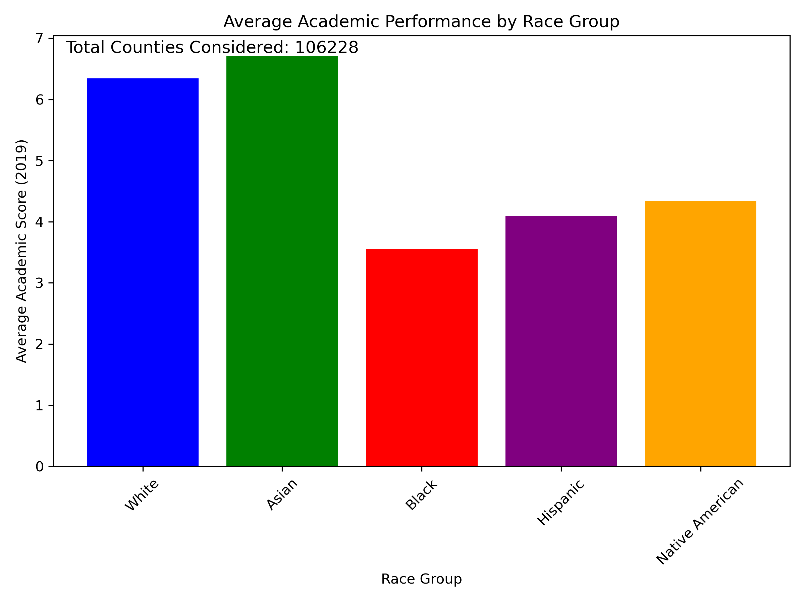
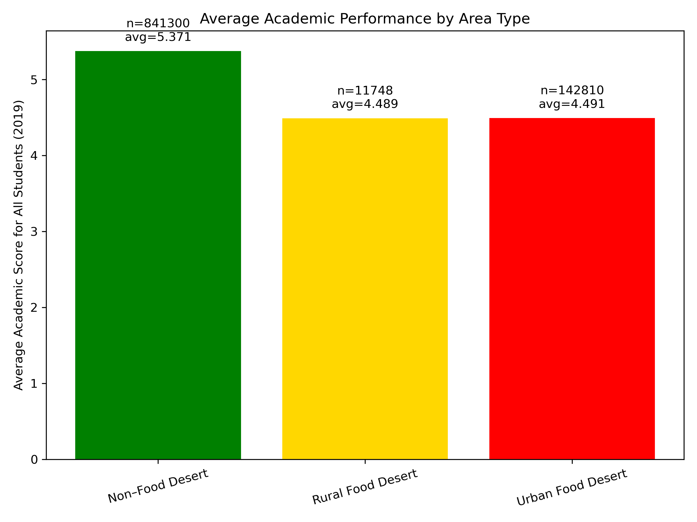
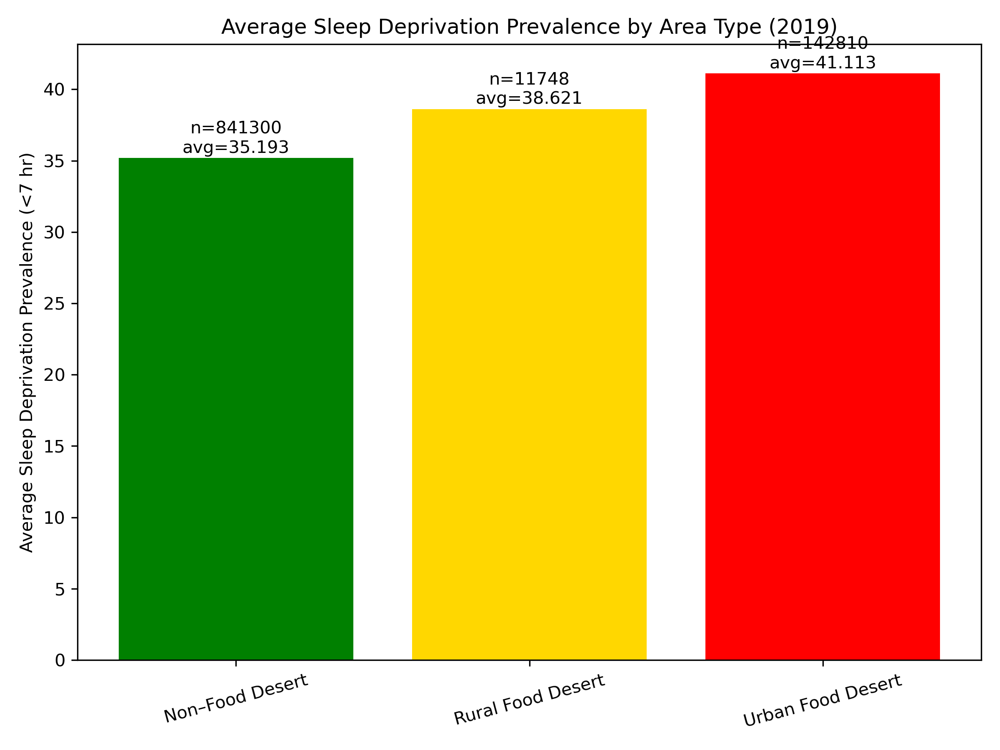
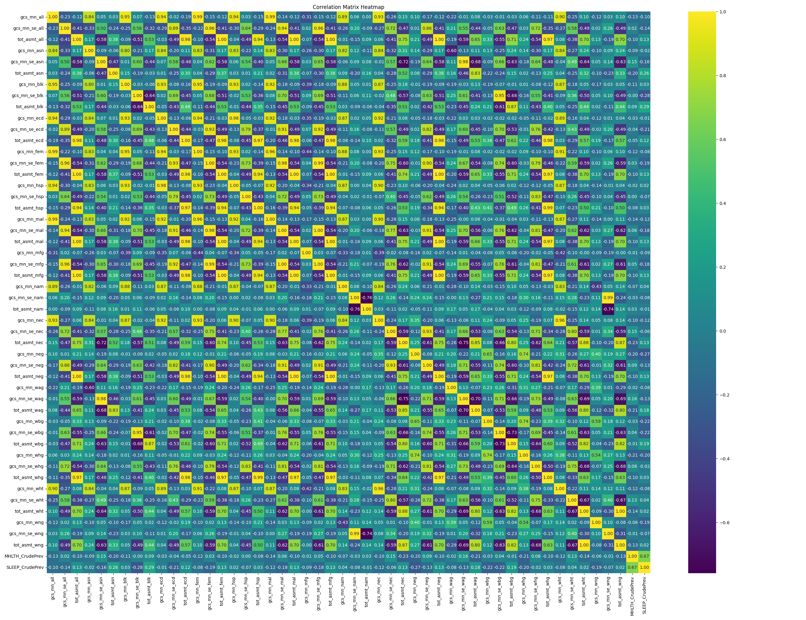
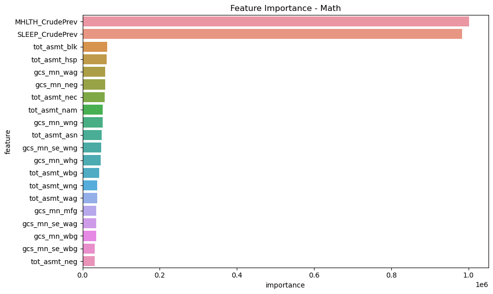
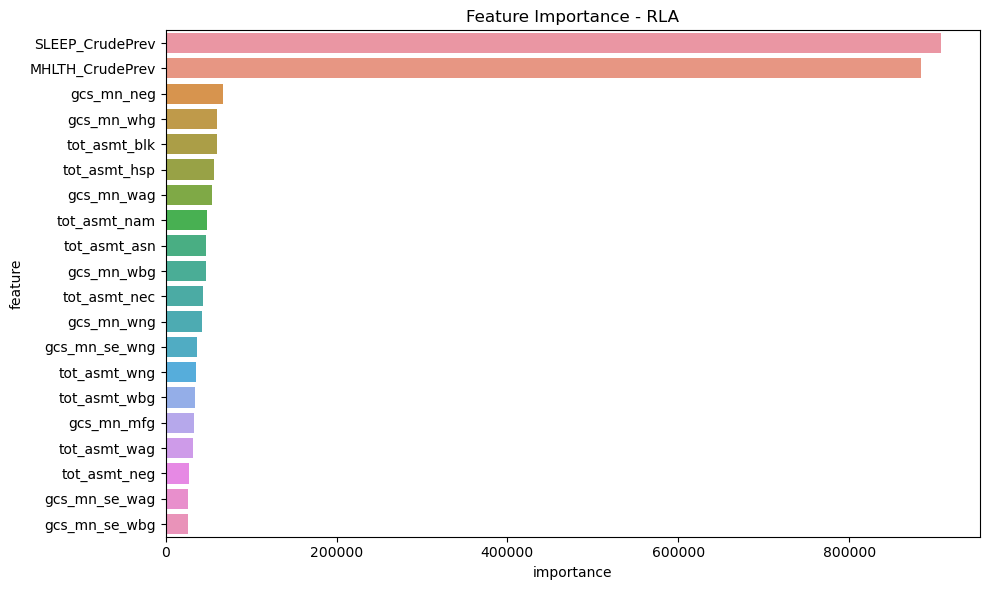

## Academic Performance and Sleep Deprivation by Race and Area Type

| Race Group Performance | Area Type Performance | Sleep Deprivation |
|------------------------|-----------------------|-------------------|
|  |  |  |

**Why did you pick this representation?**
We used grouped bar charts across all three visualizations because they offer a straightforward and intuitive way to compare categorical variables against a continuous metric. This format works well for communicating contrasts—both across race groups and across area types (Non-Food Desert, Rural Food Desert, Urban Food Desert). The consistency in visual structure across charts also helps the viewer process and compare the information more easily.

**What alternative ways might you communicate the result?**

* A multi-panel dashboard combining race group and area type within the same figure could offer a more integrated comparison.
* Boxplots could be used to show the distributions of scores or sleep deprivation within each category, providing insights into variability.
* Scatter plots with overlays could explore correlations, such as between sleep deprivation and academic performance.

**Were there any challenges visualizing the results, if so, what were they?**
Visualizing the results was relatively straight forward, especially after having our data already cleaned
and grouping the counties into rural food deserts, urban food deserts, and non-food deserts. The only
additional think we included to better the visualizations that was a bit tricky was the specifically colored labelling of these groups that would make the most sense for the context, as well as adding data labels for clearer visuals.

**Will your visualization require text to provide context or is it standalone?**
These visualizations benefit from minimal but essential textual context. Labels like sample sizes (`n`) and averages (`avg`) embedded in the charts themselves help ground the data. However, some additional explanatory text is necessary to guide interpretation—especially regarding what "academic performance" or "sleep deprivation prevalence" represent and how to understand disparities across groups.

## Correlation Heatmap

| Correlation Coefficient Heatmap  |
| ------------------------------- |
|  |

**Why did you pick this representation?**
Before training our data we wanted to explore the relationships present in our dataset as well as any potentailly co-linear variables that we should remove before ML training. While we could have used a ranked bar chart of the correlation coefficients, visualizing the results in a symmetric heatmaps allows for much easier understanding of the data and easier identification of patterns between variables. We can see that there were a number of variable pairs which had absolute coefficients greater than 0.95 which indicates strong co-linearity which we removed before training.

**What alternative ways might you communicate the result?**
* We could have used a bar chart to visualize the correlation coefficients. Additionally, we could have sorted this to identify the co-linear pairs.
* Scatter plots could have also been used to visualize smaller sets of features and the strength of their relationships

**Were there any challenges visualizing the result, if so, what were they?**
Since there are a lot of features, it was hard to get everything fitting in a graph where the labels and annotations weren't too cluttered while also remaining legible to the viewer.

**Will your visualization require text to provide context or is it standalone?**
Yes, this correlation coefficient heatmap should also include a caption that describes what the feature data is and where it comes from as well as what correlation coefficients are and how to interpret the annotated values and the color scale. For example, we can mention that strong positive (yellow) and negative (blue) correlation coefficients both indicate strong linear relationships.

## XGBoost Important Features (Top 20)

| Important XGBoost Features (Math) | Important XGBoost Features (RLA) |
| --------------------------------- | -------------------------------- |
|  |  |

**Why did you pick this representation?**
We choose this visualization to help us better understand what features contributed the most to our XGBoost model's predictions as well as the magnitudes of those impacts. Using a bar chart of our sorted feature importance values allows us to quickly answer this question while also providing a good representation of the importance magnitudes.

**What alternative ways might you communicate the result?**
* A scatter plot could have been used to visualize the distribution of all the features and their importance scores
* Similarly a heatmap could have been used to visualize the importance scores of the input features.

**Were there any challenges visualizing the result, if so, what were they?**
Since this is a relatively simple graph, making it more visually appealing was the main challenge we had.

**Will your visualization require text to provide context or is it standalone?**
Yes. This visualization would require us to explain what a XGBoost model is and what its feature importance score mean and how they are calculated. This information is necessary for understanding what these values mean in the context of our model and why the relative magnitudes are important.

