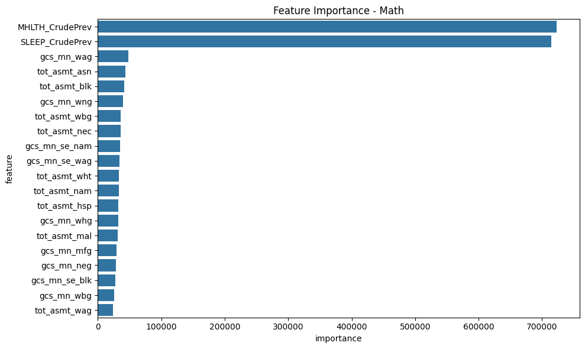
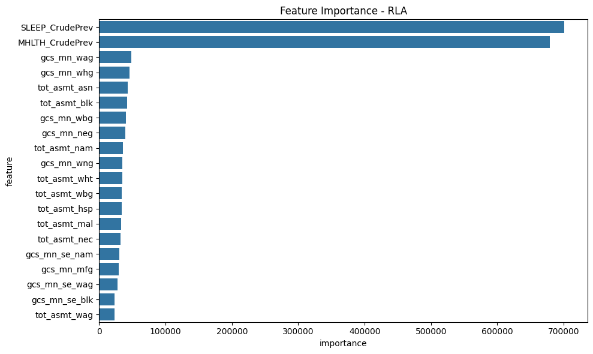

# Analysis Deliverable

## Analysis Question 1: Is there a statistically significant difference in the academic performance across race groups? 

### Why did you use this statistical test or ML algorithm? Which other tests did you consider or evaluate? What metric(s) did you use to measure success or failure, and why did you use it? What challenges did you face evaluating the model? Did you have to clean or restructure your data?

For this question, we used pairwise 2-sample t-tests to compare mean education scores across different racial groups (White, Asian, Black, Hispanic, Native American). The 2-sample t-test is appropriate here because we’re interested in determining whether the mean values of 2 independent groups (e.g., White vs. Black) are significantly different from each other. The t-test assumes that the samples are independent and drawn from populations with approximately normal distributions, which is reasonable given our large sample size (over 100,000 entries). A 1-sample t-test would not be appropriate here as we are comparing between each of the 2 groups pairwise.

We used the p-value from each t-test as our primary metric. A p-value less than 0.05 indicates that the difference in group means is statistically significant — meaning it's unlikely the difference is due to random chance. Also, the t-statistic also helped assess the magnitude of difference (larger values indicate more separation between groups). We ran this t-test pairwise across all race pairings (White vs Black, Asian vs Hispanic, etc) to view any potential differences. 

To clean the data, we did not have any major challenges. All we did was drop the rows with missing values in for each races' educational score column (gcs_mn_wht, gcs_mn_asn, etc.). This did, however, decrease our analysis sample size from 995,894 counties to 106,228 counties.

### What is your interpretation of the results? Do you accept or deny the hypothesis, or are you satisfied with your prediction accuracy? For prediction projects, we expect you to argue why you got the accuracy/success metric you have. Intuitively, how do you react to the results? Are you confident in the results?

Every single pairwise t-test resulted in statistically significant differences, with extremely small p-values (often reported as 0.0000e+00, meaning very close to zero). This means we can confidently reject the null hypothesis that these racial groups have the same mean education score. The t-statistics show both the direction and magnitude of differences. 

For example, the t-statistic of 364.736 between White and Black groups indicates a large difference, with White groups having significantly higher scores. On the other hand, a negative t-statistic, like for White vs. Asian (-41.321), suggests the Asian group had higher mean scores than the White group, both with statistically significant scores supported with a p-value < 0.05. These results to us make sense, but we found a couple statistics particularly surprising. For example, the t-statistic between Hispanic vs Native American being -31.568 and between Black vs Native American being -98.411, both insinuating that Native Americans are scoring statistically higher (supported by our p-values lower than 0.05) than Hispanic and Black populations. However, after comparing our results with existing research, we came to the conclusion that this might not be as surprising due to the inherently smaller sample size of the Native American population in our data compared to these other populations.

## Analysis Question 2: Is there statistical significance in academic performance between urban food deserts, rural food deserts, and non food deserts?

### Why did you use this statistical test or ML algorithm? Which other tests did you consider or evaluate? What metric(s) did you use to measure success or failure, and why did you use it? What challenges did you face evaluating the model? Did you have to clean or restructure your data?
For this research question, we used a one sample t-test to compare the mean average academic performance of food deserts against the standard known mean score of Non-Food Desert communities. Ultimately one sample t-test helps determine if the mean score in our food deserts are statistically significantly different from the non-food desert mean. I considered to use two sample t-test but decided a one-sample test could be leveraged as non-food deserts represents a good baseline population.

The metrics we used to measure the success of our tests were the p-value scores from the one-sample t-test to determine statistical significance. A p-value less than 0.05 indicates that the difference in group means is statistically significant — meaning it's unlikely the difference is due to random chance. The t-statistic score also assess the magnitude of difference where larger values indicate more separation between groups. We ran the one-sample t-test to fully understand the differences in scores between urban/rural food deserts vs non food desert communities.

We did not face major challenges to clean the data. The minor challenges faced was to accurately seperte the data into the proper area types Urban vs Rural Food deserts vs Non Food deserts. The required creating an additional column to represent its category. We also cleaned the data by dropping data with missing gcs_mn_all, this was to ensure the accuracy in statistical testing. 

### What is your interpretation of the results? Do you accept or deny the hypothesis, or are you satisfied with your prediction accuracy? For prediction projects, we expect you to argue why you got the accuracy/success metric you have. Intuitively, how do you react to the results? Are you confident in the results?
Null Hypothesis: There is no significant difference in average education scores between urban/rural food deserts and non food desert communities
Alternative Hypothesis: There is a significant difference in average education scores between urban/rural food deserts and non food desert communities

Urban Food Desert vs. Non-Food Desert avg (5.371):
  t-statistic = -172.606, p-value = 0.0000e+00

Rural Food Desert vs. Non-Food Desert avg (5.371):
  t-statistic = -47.711, p-value = 0.0000e+00

The results deny the null hypothesis. Both scores report an extremely small p-value often truncated and represented as 0.0000e+00 due to limits of how small a decimal can be. In addition the t values for both groups were highly negative demonstrating food deserts score well below non-food deserts. The t-stat and p value combination demonstrate that there is a statistically significant lower academic perforamnce from urban and rural food desert communitites when comparing to their non-food desert counterparts. 

We are satisfied and confident with the results because the large t-values and extremely small p-values demonstrate these trends aren't simply by chance. Also it does agree with our prediction as we initially believed food deserts would score lower on the academic performance. We are not shocked by the results because based on our research limited access to healthy foods is linked with systemic socioeconomic disadvantages and equity concerns. Therefore these results validate that food deserts are a valid variable and factor when analyzing education inequality. 

## Analysis Question 3: Is there statistical significance in sleep deprivation between urban food deserts, rural food deserts, and non food deserts?

### Why did you use this statistical test or ML algorithm? Which other tests did you consider or evaluate? What metric(s) did you use to measure success or failure, and why did you use it? What challenges did you face evaluating the model? Did you have to clean or restructure your data?

For this question, we used a 2-sample t-test to compare the mean prevalence of sleep deprivation across different area types: Urban Food Desert, Rural Food Desert, and Non–Food Desert counties. This test is appropriate because:

(1) We are comparing the means of a continuous variable (SLEEP_CrudePrev).

(2) The samples are independent.

(3) It is a standard method for testing whether two groups have significantly different means.

To measure success and failure, we used the p-value from the t-tests:
A p-value < 0.05 indicated statistically significant differences in means. The t-statistic also helped assess the magnitude of difference (larger values indicate more separation between groups).

To prepare the data, we did not have any major challenges. All we did was drop the rows with missing values in the SLEEP_CrudePrev column and (previously for analysis question 2) ensured that area_type was properly defined for each county.

### What is your interpretation of the results? Do you accept or deny the hypothesis, or are you satisfied with your prediction accuracy? For prediction projects, we expect you to argue why you got the accuracy/success metric you have. Intuitively, how do you react to the results? Are you confident in the results?

All pairwise comparisons (between Urban Food Deserts and Non-Food Deserts as well as Rural Food Deserts and Non-Food Deserts) produced extremely small p-values (effectively zero). At first, we were a bit surprised with how small these p-values are, as under the hood, the smallest number that can be represented is 5e-324. That is, our p-values must be even smaller than this number as they are coming out as effectively 0. This suggests a very strong statistical difference in sleep deprivation prevalence between urban food deserts, rural food deserts, and non–food desert areas. We also noticed that the t-statistic was particularly large for Urban vs Non-Food Desert, indicating a larger difference in means.

We reject the null hypothesis in all comparisons. That is, we found strong evidence that urban and rural food deserts do differ significantly from non–food deserts in terms of sleep deprivation prevalence.

According to these results, it does makes sense that urban food deserts, often associated with environmental stressors, limited access to healthcare, noise, and light pollution, would have higher sleep deprivation. In a similar manner, the rural difference was also significant, though smaller — possibly due to limited healthcare access and economic factors.

The high confidence is reinforced by our large sample sizes, very small p-values (effectively 0), and clear differences in group means (as shown in our t-statistics and visually on the bar graph).

## Analysis Question 4: Is there a statistical significance in education scores across racial groups when comparing communities with high versus low sleep deprivation prevalence?

### Why did you use this statistical test or ML algorithm? Which other tests did you consider or evaluate? What metric(s) did you use to measure success or failure, and why did you use it? What challenges did you face evaluating the model? Did you have to clean or restructure your data?

For this question, we used a 2-sample t-test to compare to the mean educational scoress across racial groups in communities in areas classfied by high versus low sleep deprivation. I mostly considered 2 sample t-test because the t-test allows us to determine whether there exists differences between the means of two independent groups which in our case are racial groups. At the end of the test we can prove using the t-values and p-values whether there exists statistically signifcant trends. The t-test assumes that the samples are independent and drawn from populations with approximately normal distributions, which is reasonable given our large sample size (over 100,000 entries). On the other hand a 1-sample t-test would not be appropriate  as we want to compare 2 groups pairwise.

The metrics we used to measure the success of our tests were the p-value scores from the one-sample t-test to determine statistical significance. A p-value less than 0.05 indicates that the difference in group means is statistically significant — meaning it's unlikely the difference is due to random chance. The t-statistic score also assess the magnitude of difference where larger values indicate more separation between groups. Both p-value and t-stat score could be applied to each racial comparison pairing.

To clean the data, we did not have any major challenges. All we did was drop the rows with missing values in for each races' educational score column (gcs_mn_wht, gcs_mn_asn, etc.).

### What is your interpretation of the results? Do you accept or deny the hypothesis, or are you satisfied with your prediction accuracy? For prediction projects, we expect you to argue why you got the accuracy/success metric you have. Intuitively, how do you react to the results? Are you confident in the results?
The first hypothesis we tested for this question was Broad Comparison between non sleep deprived and sleep deprived communities

Null Hypothesis: There is no significant difference in average education scores between high and low sleep deprivation communities
Alternative Hypothesis: There is a significant difference in average education scores between high and low sleep deprivation communities
This test resulted in t-statistic = -34.330, p-value = 7.3314e-257. Due to the p value being overwhelmingly less than 0.05 we determined there is a statisically significant difference in education scores enough to reject the null hypothesis. In addition the t-state had a large negative value, demonstrating areas with high sleep deprivation scored lower than areas with low sleep deprivation. 

We agree with the results of our analysis. Communities with high sleep deprivation are prone to negative health effects which are often linked with societal, economic, or educational inequities. It is reasonable to conclude these lack to resources and added negative health effects can impact students scores.

The high confidence is reinforced by our large sample sizes, very small p-values (effectively 0), and clear differences in group means.

-----------------------------------------------------

Then next hypothesis we tested during this analysis is Comparing students in a community with high sleep deprivation

Null Hypothesis: There is no significant difference in education scores between the two racial groups in high sleep prevalence communities.

Alternative Hypothesis :There is a significant difference in education scores between the two racial groups in high sleep prevalence communities.

The pairwise two sample t-test on different racial groups resulted in 10 two sample t-test racial pairings. Each two-sample t-test pairing resulting in a high t value along with a very low p-value(highest was 7.7218e-124). With each p-value being less than 0.05 we determined there is a statisically significant difference in education scores enough to reject the null hypothesis. In addition each pairing generated high non-zero t-stats scores demonstrating there is strong evidence of differences in scores between racial group. Additionally the t-statistics show both the direction and magnitude of differences. 

We reject the null hypothesis in all comparisons because of the low p-value and high magnitude t-stat score for each racial pairing. Therefore we can say there exists a significant difference in education scores between two racial groups in high prevelance communities

-----------------------------------------------------

Then next hypothesis we tested during this analysis is Comparing students in a community with low sleep deprivation

Null Hypothesis: There is no significant difference in education scores between the two racial groups in low sleep prevalence communities.

Alternative Hypothesis: There is a significant difference in education scores between the two racial groups in low sleep prevalence communities.

The pairwise two sample t-test on different racial groups resulted in 10 two sample t-test racial pairings. Each two-sample t-test pairing resulting in a high t value along with a very low p-value(highest was 4.6414e-98). With each p-value being less than 0.05 we determined there is a statisically significant difference in education scores enough to reject the null hypothesis. In addition each pairing generated high non-zero t-stats scores demonstrating there is strong evidence of differences in scores between racial group. Additionally the t-statistics show both the direction and magnitude of differences. 

We reject the null hypothesis in all comparisons because of the low p-value and high magnitude t-stat score for each racial pairing. Therefore we can say there exists a significant difference in education scores between two racial groups in low prevelance communities

-------------------------------------------------------
When comparing the two sample t-test results between high and low sleep prevalance communities, we were initially suprised by the difference of t-stat results between low/high sleep deprivation communities. 

| Racial Pairing              | T-Stat (High Sleep Dep) | T-Stat (Low Sleep Dep) |
|----------------------------|--------------------------|-------------------------|
| White vs Asian             | -36.306                  | -22.686                 |
| White vs Black             | 239.147                  | 276.960                 |
| White vs Hispanic          | 194.038                  | 229.291                 |
| White vs Native American   | 158.128                  | 187.958                 |
| Asian vs Black             | 253.055                  | 261.920                 |
| Asian vs Hispanic          | 212.198                  | 220.333                 |
| Asian vs Native American   | 179.544                  | 186.981                 |
| Hispanic vs Black          | 51.211                   | 52.539                  |
| Hispanic vs Native American| -23.701                  | -21.038                 |
| Black vs Native American   | -70.910                  | -68.372                 |

Specifically we noticed that the t-stat value increased in magnitude significantly except for White vs Asian pairing(closer to 0). On the otherhand Hispanic/Black vs Native American stayed relatively constant. This was suprising as we initially believed that in locations with communities of low sleep deprivation would generate lower racial score disparities. We beleived this since communities with better health scores have access to better resources and as tested in question 3 are commonly not in food deserts. However as seen in the table the racial disparities only grew when comparing Asian/White with Underrepresented Minorities(Native American, Black, Hispanic). This underscores that sleep alone doesn’t close the achievement gap — inequities are embedded in deeper systemic issues such as school funding, access to support services, teacher quality. Lastly the fact that White and Asian students seem to benefit more from improved sleep prevalence implies that not all groups have the resources to capitalize on better conditions 

## Overall Analysis
### Did you find the results corresponded with your initial belief in the data? If yes/no, why do you think this was the case?
Yes and no, see our individual responses for each analsysi question above for further explanation.

### Do you believe the tools for analysis that you chose were appropriate? If yes/no, why or what method could have been used?
Yes, the tools we chose (mainly independent two-sample t-tests) were appropriate for our analysis questions. For each of our goals to compare means of education scores or prevalence of sleep deprivation across different racial groups and area types, t-test were a statistically valid method to assess whether the observed differences are likely due to chance or represent meaningful disparities.

For further analysis, we also decided to use grouped bar charts and descriptive statistics (mean, variance, std) provided a solid foundation to visually interpret the differences in our attributes across area types. This helped us support our findings verified in our t-tests.

See our individual responses for each analysis qeustion above for further explanation.

### Was the data adequate for your analysis? If not, what aspects of the data were problematic and how could you have remedied that?
Yes, the data was adequeate for our analysis. The sample size is quite large with 995,894 entries, and even after cleaning for missing values in all our used attributes' columns, with over 106,228 entries.

# ML Component

For our ML tasks we trained two models: 1) XGBoost classifier and 2) K-Means clustering. For both of our models, we used the pairwise combinations of the `Urban` and `LATracts_half` binary categorical columns. After dropping rows with `nan` values in the relevant feature columns we were left with 3 distinct classes in our dataset: `11` (urban and food desert), `10` (urban and not food desert), and `00` (not urban and not food desert). There were no `01` class data points after filtering out rows with `nan` values. The resulting dataset has a significant imbalance:

| y   | count |
| -   | -     |
| 11  | 79328 |
| 10  | 9816  |
| 00  | 5369  |

For the training features, we use all the academic performance data as well as the `SLEEP_CrudePrev` and `MHLTH_CrudePrev` columns from the health dataset. We use a greedy search to remove the minimum number of features to remove any pairwise Pearson Correlation coefficients above 0.95. This was done to remove any potentially unnecessary/collinear columns. The dataset was then split and used for K-fold cross validation. Both of these steps were done with stratification based on the target variable. We also split the dataset by academic subject and trained each of our models on each. Out research hypothesis for our ML models is: can we predict the class (urban + food desert) of a given census tract using sleep/mental health and standardized academic performance. Given the large class imbalance (83.54% and 83.31% majority classes in the Math and RLA datasets), if any of our models can outperform the baseline accuracies that suggests that there is a predictive relationship between our features and labels.

## Model 1: XGBoost classifier

We used XGBoost as it is the state-of-the-art when it comes to quick and easily applied ML algorithms, often outperforming deep neural networks and other complex ML algorithms. Additionally, XGBoost is an ensemble model that consists of decision trees which are good for interpretation. We use the following parameter grid for training and validation:

| parameter | values  |
| - | - |
| `learning_rate`     | [0.3, 0.1, 0.05]  |
| `max_depth`         | [32, 64]  |
| `subsample`         | [0.5, 0.75, 1.0] |
| `colsample_bytree`  | [0.5, 0.75, 1.0] |
| `gamma`             | [0.0, 0.1, 0.5] |

`n_estimators` was set to 100,000 to ensure that the models could converge and hit early stopping (described below).

We used a 5-fold stratified cross validation. For each fold, we also included early stopping with the fold validation set. Due to the class imbalance in the dataset, we also applied a sample weighting scheme that scales the impact of each sample based on the distribution of the labels across the dataset. Specifically, this takes affect in two places: 1) it weights how much XGBoost considers each sample when it trains its ensemble trees and 2) it allows ut to calculate a balanced accuracy metric on the results. For our main evaluation metric we vanilla accuracy score. However, we also calculate balanced accuracy (weighted by distribution), weighted multiclass precision, weighted multiclass recall, and weighted multiclass f1 scores.

### Math Dataset

Our optimal parameters for the math dataset are:

| parameter | values  |
| - | - |
| `learning_rate`     | 0.1  |
| `max_depth`         | 64 |
| `subsample`         | 1.0 |
| `colsample_bytree`  | 1.0 |
| `gamma`             | 0.0 |

The dataset's baseline accuracy is 83.54% as that is the percentage of all the data points which belong to the dominant class. By default, balanced accuracy has a baseline score of $\frac{1}{n}$ where $n$ is the number of classes - in our case, this is 33%. Below is the table of all result metrics for the best parameters when trained on the whole math dataset:

| Metric                 | Train   | Validation | Test    |
|------------------------|---------|------------|---------|
| Accuracy               | 0.9939  | 0.9190     | 0.9180  |
| Balanced Accuracy      | 0.9974  | 0.8165     | 0.8132  |
| Precision              | 0.9941  | 0.9189     | 0.9172  |
| Recall                 | 0.9939  | 0.9190     | 0.9180  |
| F1 Score               | 0.9939  | 0.9189     | 0.9176  |

As we can see, the model scores approximately 8.4% higher than the already high baseline accuracy. Additionally, this performance extends to the minority classes as can be seen by the 81.32% balanced accuracy on the test set. This is also supported by the >0.9 precision, recall, and f1 scores.

As XGBoost provides access to its feature weights, we also investigated which features were most important in the trained model.

As we can see in the graph, XGBoost places a significant amount of importance in the health features. The top academic dataset features were `gcs_mn_wag` (average score gap between white and asian students) and `tot_asmt_asn` (number of observed asian students) followed by total counts of observed black students and the white-native-american student gap. Overall, gap metrics and counts of samples per race seemed to be the most important academic dataset features.

### Reading/Language Arts Dataset

Our optimal parameters for the math dataset are:

| parameter | values  |
| - | - |
| `learning_rate`     | 0.1  |
| `max_depth`         | 64 |
| `subsample`         | 1.0 |
| `colsample_bytree`  | 1.0 |
| `gamma`             | 0.0 |

The dataset's baseline accuracy is 83.31%. Below is the table of all result metrics for the best parameters when trained on the whole math dataset:

| Metric                 | Train   | Validation | Test    |
|------------------------|---------|------------|---------|
| Accuracy               | 0.9944  | 0.9315     | 0.9301  |
| Balanced Accuracy      | 0.9972  | 0.8335     | 0.8366  |
| Precision              | 0.9946  | 0.9310     | 0.9301  |
| Recall                 | 0.9944  | 0.9315     | 0.9301  |
| F1 Score               | 0.9945  | 0.9312     | 0.9301  |

Again, we can see that the model scores approximately 8.4% higher than the already high baseline accuracy. This performance extends to the minority classes as can be seen by the 83.66% balanced accuracy on the test set. This is also supported by the >0.93 precision, recall, and f1 scores.

Similarly to the math dataset, XGBoost places a significant amount of importance in the health features. The top academic dataset features were `gcs_mn_wag` (average score gap between white and asian students) and `gcs_mn_whg` (same for white hispanic students) followed by total counts of observed asian and black students. Again, gap metrics and counts of samples per race seemed to be the most important academic dataset features.

## Model 2: K-Nearest Neighbors Clustering

We used K-Nearest Neighbors (KNN) as it is a simple and interpretable unsupervised machine learning algorithm that also supports one-hot encoded categorical features. We use the following parameter grid for training and validation:

| parameter | values  |
| - | - |
| `n_neighbors`     | [3, 5, 7, 9, 11]  |
| `weights`         | ["uniform", "distance"]  |
| `p`         | [1, 2] |

* `p` refers to manhattan vs euclidean distance for neighbor calculations

We also used a 5-fold stratified cross validation for KNN. Again, we stratified our dataset for the initial `train_test_split` and the k-fold cross validation. Along with accuracy and balance accuracy, we also reported the adjusted rand index (`ARI`), normalized mutual information (`NMI`), and the homogeneity score of the clusters. `ARI` measures the similarity between two clusterings by considering all pairs of samples and counting pairs that are assigned consistently in both clusterings. It adjusts for chance, meaning a score of 0 indicates random labeling, while 1 means perfect match. `NMI` quantifies the mutual dependence between the predicted and true labels using information theory; it normalizes mutual information by the average entropy of the labelings, ranging from 0 (no mutual information) to 1 (perfect correlation). Homogeneity measures whether each cluster contains only members of a single class. It is computed using entropy: a cluster is homogeneous if all its elements belong to the same ground-truth class, with values ranging from 0 to 1.

Unlike the XGBoost model, we used the average of all the metrics (accuracy, balanced accuracy, `ARI`, `NMI`, and homogeneity) for the selection of best parameters in the cross validation. This works as these are all 0-1 metrics where 1 is a perfect score.

### Math Dataset

Our optimal parameters for the math dataset using KNN are:

| Parameter       | Value          |
|----------------|----------------|
| `n_neighbors`  | 7              |
| `weights`      | uniform        |
| `p` (distance) | 2 (Euclidean)  |

The baseline accuracy for the math dataset remains **83.54%**, corresponding to the majority class proportion. Balanced accuracy, with three classes, has a baseline of **33.33%**. Below is the table of evaluation metrics for the best KNN parameters trained and evaluated on the dataset:

| Metric                 | Train   | Test    |
|------------------------|---------|---------|
| Accuracy               | 0.9949  | 0.7963  |
| Balanced Accuracy      | 0.9927  | 0.4024  |
| Adjusted Rand Index    | 0.9775  | 0.0763  |
| Normalized Mutual Info | 0.9434  | 0.0328  |
| Homogeneity            | 0.9472  | 0.0266  |

Although the overall accuracy is comparable to the baseline, the balanced accuracy reveals the model struggles with minority class performance. Cluster-based metrics such as ARI and NMI are also low, indicating limited clustering performance when compared to the true labels. These results suggest that KNN captures majority class trends but lacks the discrimination power for complex multi-class separation in this dataset.

---

### Reading/Language Arts Dataset

Our optimal parameters for the RLA dataset using KNN are:

| Parameter       | Value         |
|----------------|---------------|
| `n_neighbors`  | 5             |
| `weights`      | uniform       |
| `p` (distance) | 2 (Manhattan) |

The baseline accuracy for the RLA dataset is **83.31%**. The table below presents the result metrics for the best KNN parameters:

| Metric                 | Train   | Test    |
|------------------------|---------|---------|
| Accuracy               | 0.8578  | 0.8181  |
| Balanced Accuracy      | 0.4750  | 0.3911  |
| Adjusted Rand Index    | 0.2569  | 0.0794  |
| Normalized Mutual Info | 0.1369  | 0.0297  |
| Homogeneity            | 0.1012  | 0.0223  |

Similar to the math results, the accuracy on the test set is near the baseline, but the model has difficulty generalizing to minority classes, as shown by a balanced accuracy under 40%. The clustering evaluation metrics (ARI, NMI, homogeneity, etc.) are low, suggesting the decision boundaries formed by KNN are not well aligned with the true class structure in this educational context.
